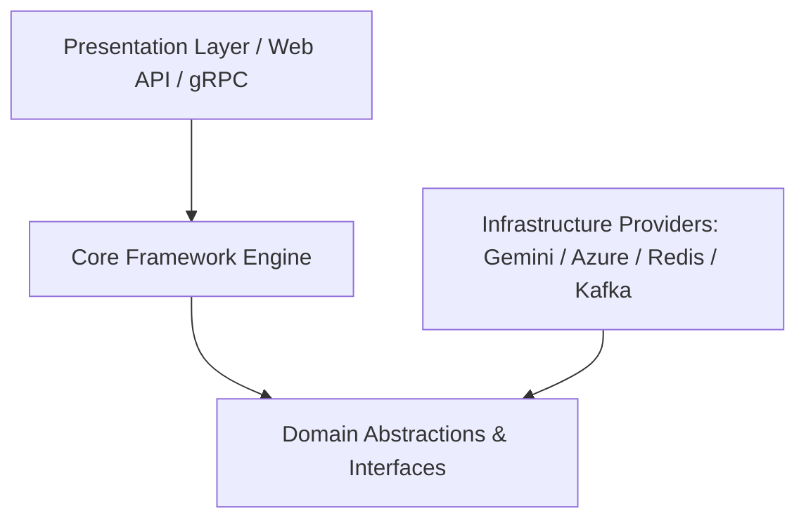

# Enterprise AI Core - Architecture Specification

## Clean Architecture Layers

### Key Components

1. **EnterpriseAgent**: Central execution facade orchestrating planning, tool execution, and memory updates.
2. **AgentBuilder**: Fluent builder pattern simplifying complex IoC setup.
3. **ToolRegistry**: Manages function schemas, validation, and invocation.
4. **MCPClient**: Handles Model Context Protocol client connections, tool discovery, and remote execution.
5. **ServiceCollection & ServiceProvider**: Lightweight, high-performance Dependency Injection container.
