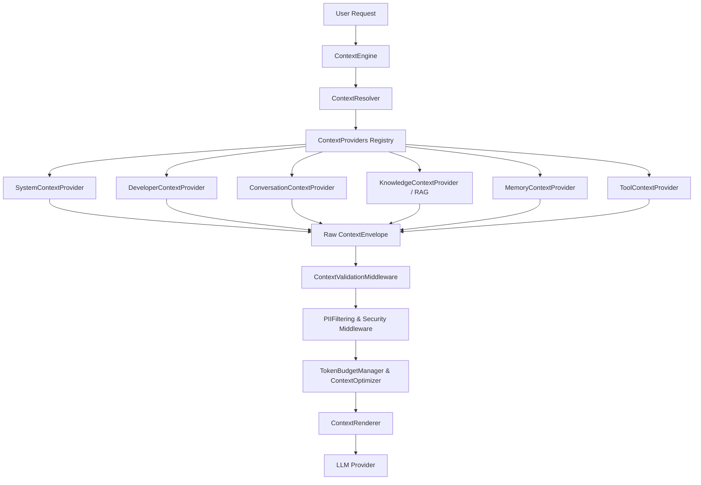

# Enterprise Context Engine Architecture

The **Enterprise Context Engine** is a core sub-system of `Enterprise-AI-Core`. It provides a provider-based, token-optimized context orchestration architecture to construct, validate, optimize, and render complete prompts before sending requests to Large Language Models.



## Key Capabilities

- **Provider-Based Extension**: Implement `IContextProvider` to inject custom domain signals.
- **Priority-Based Token Budgeting**: Automatically drops or compresses low-priority fragments when prompt budgets are exceeded.
- **Middlewares**: Redacts PII, enforces security rules, and logs context metadata automatically.
- **Template Versioning**: Manages prompt templates (`v1.0`, `v2.0`, A/B tests) via `PromptTemplateEngine`.

## Usage Quickstart

```python
from enterprise_ai_core import EnterpriseAgent
from enterprise_ai_core.context import ContextEngine, SystemContextProvider

# Fluent Builder configuration
agent = (
    EnterpriseAgent.builder()
    .use_gemini()
    .with_system_prompt("You are a Senior Architect AI Agent.")
    .build()
)

result = await agent.chat("Analyze my Cloud SLA compliance.")
print(result.value["context_summary"])
```
