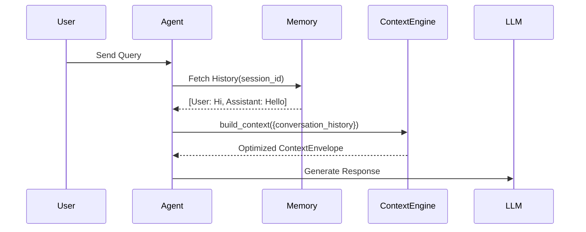

# Conversation Context & Multi-turn Management

`ConversationContextProvider` formats chat history and injects multi-turn dialogue into the context envelope under `ContextPriority.CONVERSATION_HISTORY`.

