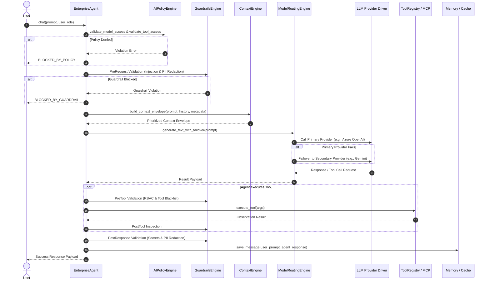
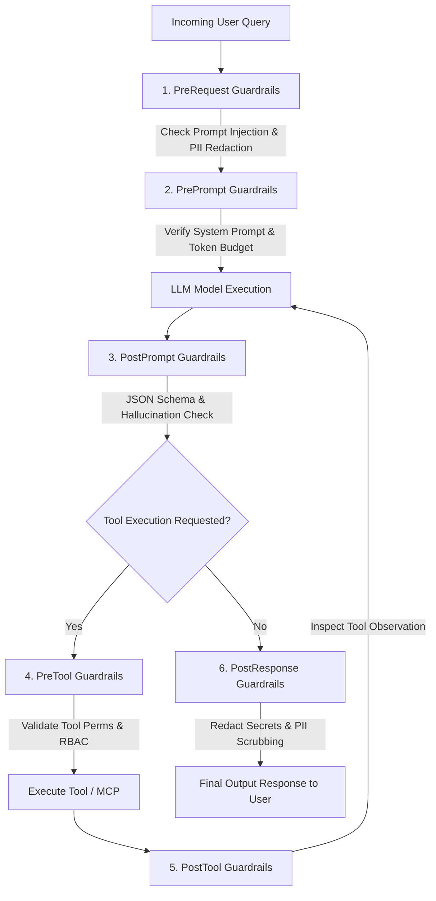
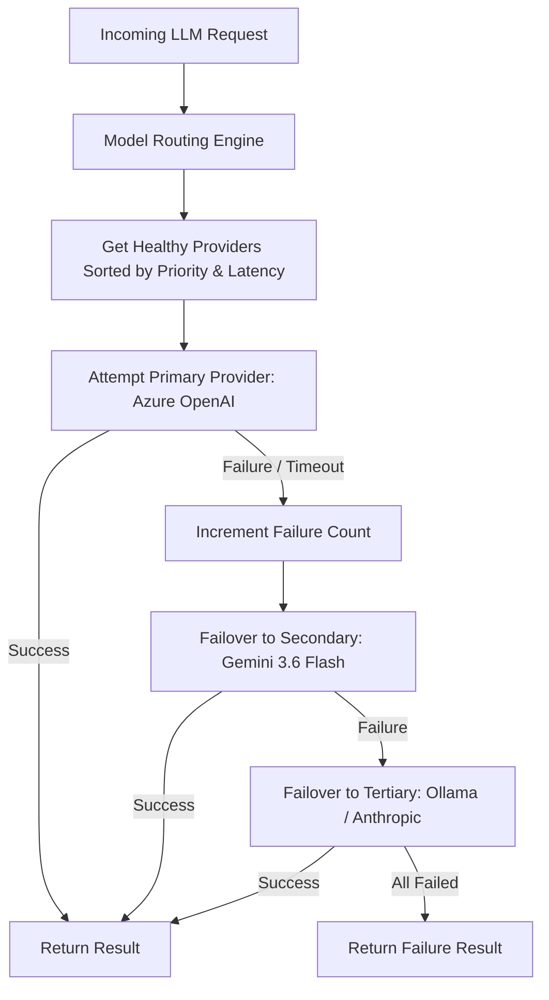
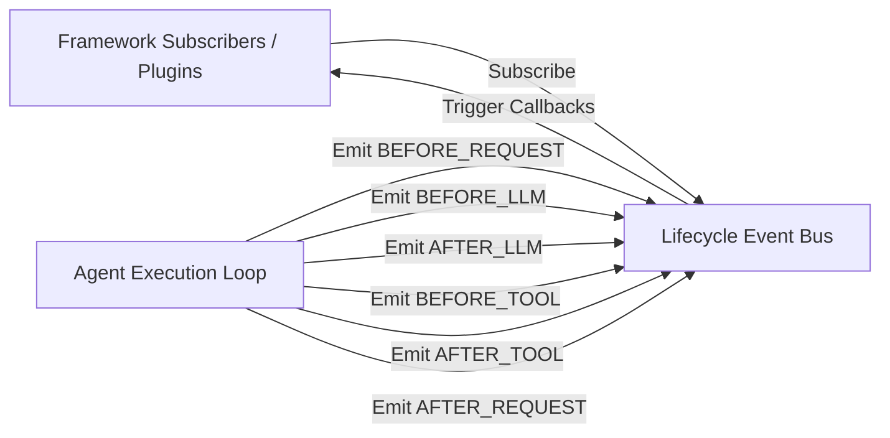

# Enterprise AI Core - System Flow Diagrams

This document contains flow diagrams illustrating the runtime execution paths across the Enterprise AI Core framework.

---

## 1. End-to-End Chat Request Flow

---

## 2. 6-Stage Guardrail Pipeline Flow

---

## 3. Model Routing & Failover Flow

---

## 4. Lifecycle Event Bus Flow

