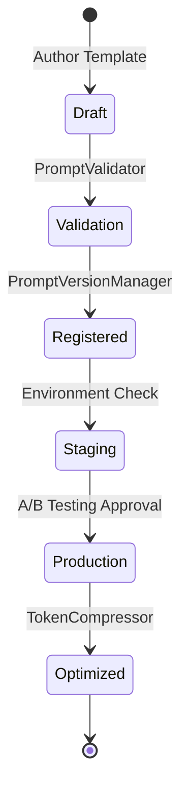

# Enterprise Prompt Management & Version Control

## Lifecycle Diagram

## Features
- **A/B Testing**: Support multiple versions (`v1.0`, `v2.0-beta`) registered in `PromptVersionManager`.
- **Environment Isolation**: Load distinct prompts based on deployment tags.
- **Validation**: Automatic variable check to prevent unpopulated `{{ variable }}` leaks.
