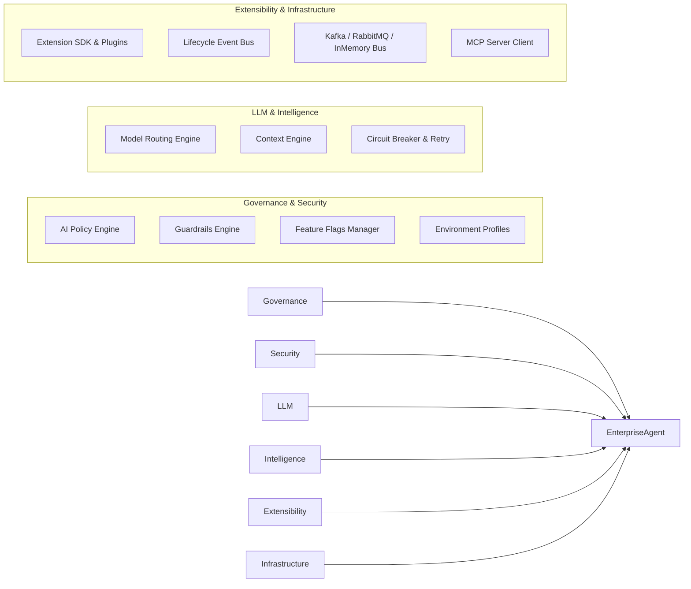

# Enterprise AI Core - System Architecture Specification

## Clean Architecture Layers

```mermaid
graph TD
    subgraph Presentation & API Layer
        REST[REST API / Web Drivers]
        GRPC[gRPC Handlers]
        CLI[Framework CLI]
    end

    subgraph Core Framework Engine
        Agent[EnterpriseAgent & Builder]
        Routing[Model Routing Engine]
        Context[Enterprise Context Engine]
        Guardrails[Guardrails Engine]
        Policy[AI Policy Engine]
        Eval[AI Evaluation Framework]
        Diag[Diagnostics Engine]
        Lifecycle[Lifecycle Event Bus]
    end

    subgraph Domain Abstractions & Interfaces
        IProvider[ILLMProvider]
        ITool[ITool / ToolRegistry]
        IMemory[IConversationMemory]
        ICache[ICacheProvider]
        IBus[IEventBus]
        IGuardrail[IGuardrail]
        IPlugin[FrameworkPlugin]
    end

    subgraph Infrastructure Providers
        Gemini[Gemini Provider]
        Azure[Azure OpenAI Provider]
        Ollama[Ollama / Anthropic]
        Redis[Redis Cache Driver]
        Kafka[Kafka / RabbitMQ Bus]
        MCP[MCP Client / Server Discovery]
        RAG[Vector Store & Doc Extractor]
    end

    Presentation & API Layer --> Core Framework Engine
    Core Framework Engine --> Domain Abstractions & Interfaces
    Infrastructure Providers --> Domain Abstractions & Interfaces
```

---

## High-Level Subsystem Integration Architecture



---

## Architectural Principles

1. **SOLID Principles**: Single responsibility modules, interface segregation, and open/closed extensibility via `FrameworkPlugin`.
2. **Dependency Injection**: IoC container (`ServiceCollection`, `ServiceProvider`) decouples concrete drivers from core business logic.
3. **Resiliency First**: Built-in Circuit Breaker, exponential backoff retries, and automatic failover across LLM providers.
4. **Policy & Guardrails Enforcement**: Zero-trust architecture enforcing RBAC, token limits, tool blacklists, PII scrubbing, and prompt injection defense at runtime.
