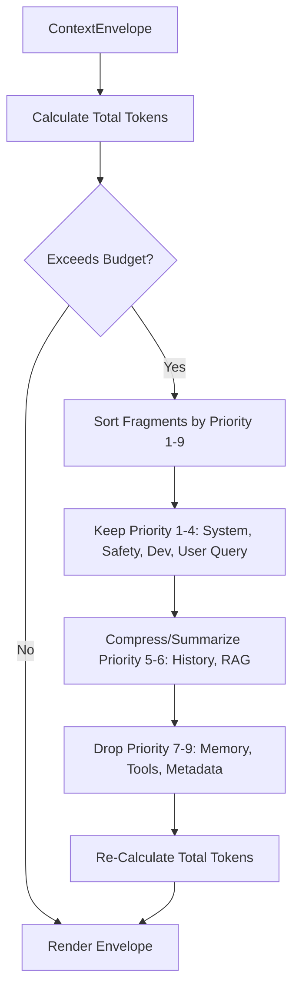

# Token Budget Management & Priority Optimization

## Context Priorities Table

| Priority | Level | Description | Behavior under Overflow |
|---|---|---|---|
| Priority 1 | `SYSTEM_PROMPT` | Core Agent Identity | Never Dropped |
| Priority 2 | `SAFETY_RULES` | Security Boundaries | Never Dropped |
| Priority 3 | `DEVELOPER_INSTRUCTIONS` | Code Instructions | Never Dropped |
| Priority 4 | `CURRENT_USER_REQUEST` | Active User Prompt | Never Dropped |
| Priority 5 | `CONVERSATION_HISTORY` | Past Turns | Summarized |
| Priority 6 | `RETRIEVED_KNOWLEDGE` | RAG Knowledge Chunks | Truncated / Ranked |
| Priority 7 | `MEMORY` | Recalled Long-term Facts | Dropped First |
| Priority 8 | `TOOL_RESULTS` | Tool Execution Outputs | Truncated |
| Priority 9 | `METADATA` | Request & Session IDs | Dropped First |
